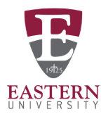

## Hi, I'm Samantha! Welcome to my Data Portfolio 

  
  &nbsp;&nbsp;&nbsp;&nbsp;
  

I’m a data enthusiast with an **M.S. in Data Science** from Eastern University and a **B.S. in Textile Engineering** from NC State. I love digging into data to uncover insights that help make smarter decisions and spark innovation. With experience in Engineering, Research & Development, and Product Development within the textile industry, I enjoy turning complex datasets into actionable solutions—because _data doesn’t lie_!

Fun fact: One of my bucket list goals is to visit all 62 U.S. National Parks. I have been to 20 so far! I'd love to hear about your favorite parks. 

## Skills

 

<!--    -->

## GitHub Projects

| | Project | Tools | Description |
|---|---|---|---|
||[Mushroom Classifier (Overview)](https://github.com/samcirceo/MushroomClassifierPUBLIC)| |Developed a CNN model with PCA in Python to classify mushrooms as poisonous or edible. *[Private repository](https://github.com/samcirceo/MushroomClassification) available upon request.*|
||[Final Grade Predictor (Overview)](https://github.com/samcirceo/FinalGradePredictorPUBLIC)|   |Machine learning model predicting final grades with strong accuracy, demonstrating preprocessing, model selection, evaluation, and data-driven insights. *[Private repository](https://github.com/samcirceo/FinalGradePredictor) available upon request.*|
||[Mental Health Predictor (Overview)](https://github.com/samcirceo/MentalHealthPredictorPUBLIC)|  |Regression model in R predicting mental health scores using exploratory data analysis and visualization techniques. *[Private repository](https://github.com/samcirceo/MentalHealthPredictor) available upon request.*|
||[New York Taxi Analysis](https://github.com/samcirceo/New-York-Taxi-Analysis)||Regression model predicting hourly NYC taxi demand across regions.|

***Private repositories:** 
Due to university policy, I cannot publicly share the code for some projects.  If you'd like access, please reach out with your GitHub username or the email associated with your GitHub account, and I will grant access. You will then receive an invitation to the repository.

## Currently Working On
Expanding my portfolio with additional machine learning and data visualization projects

## 📫 **How to reach me**

Email: samantha.circeo@eastern.edu  
LinkedIn: [samantha-circeo](https://www.linkedin.com/in/samantha-circeo-406b76123/)

